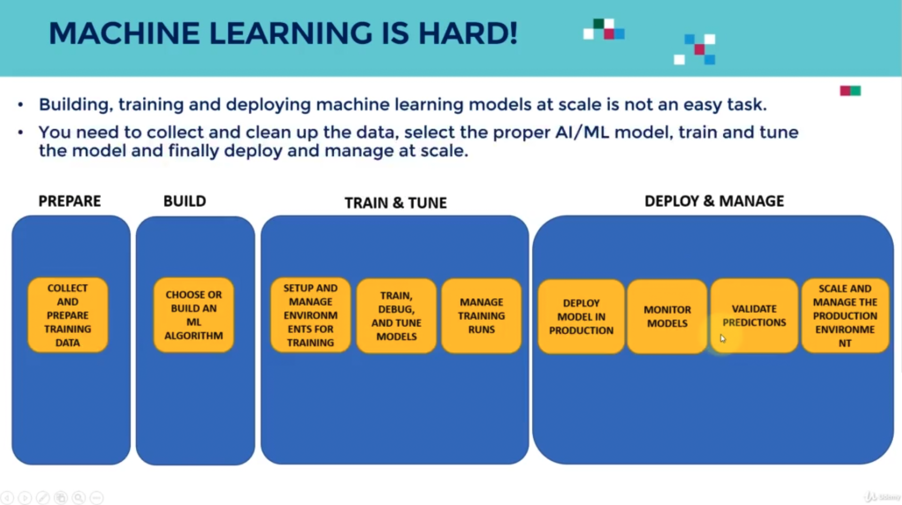
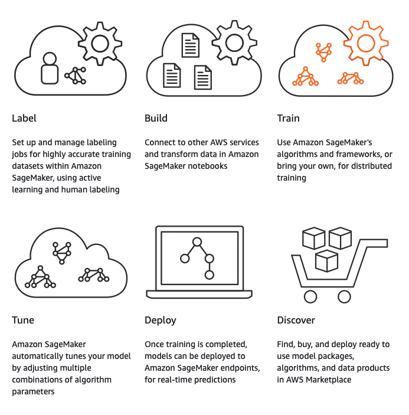
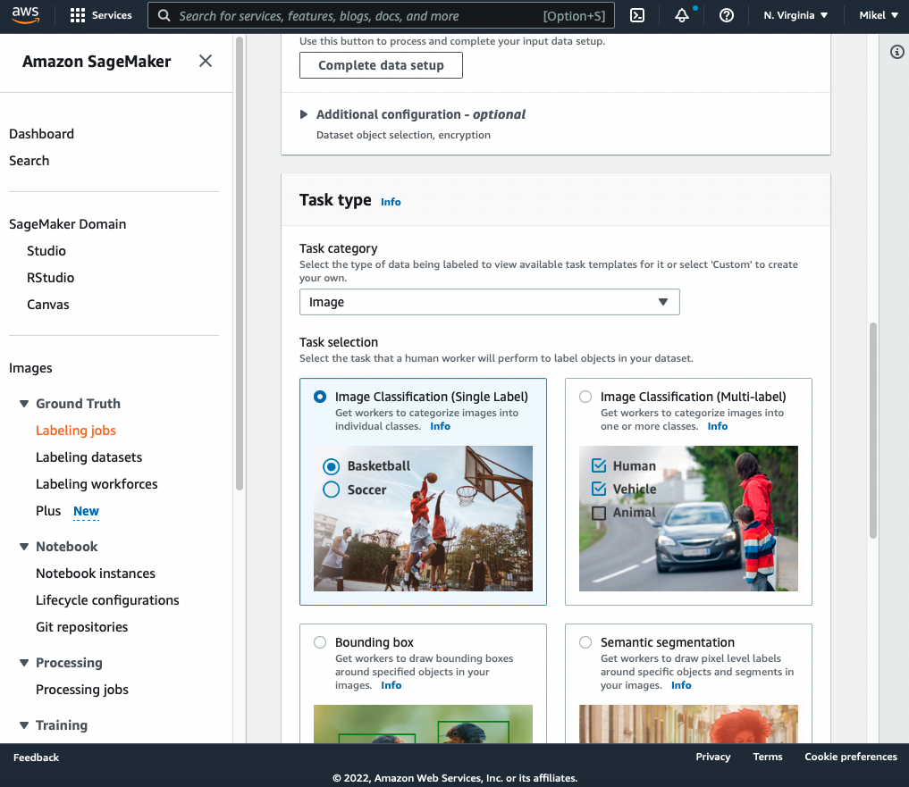
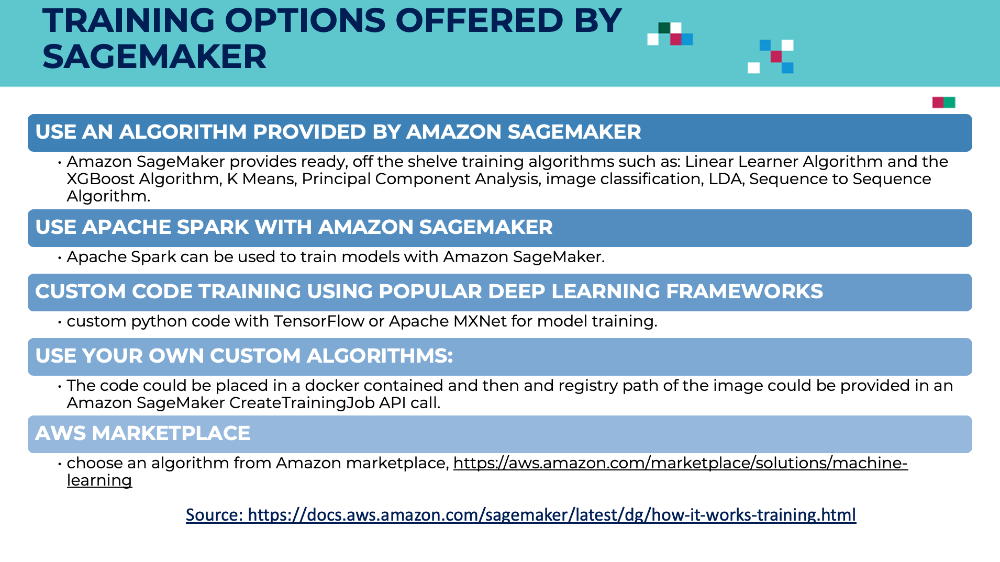
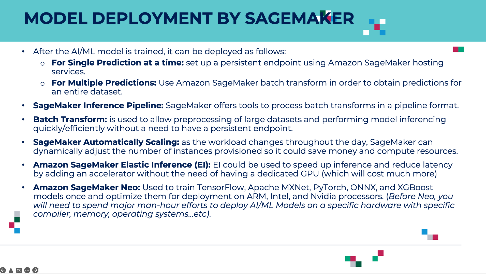

# AWS Machine Learning Guide

This is a practical guide on how to deploy ML models in AWS using SageMaker. The file is structured following the Udemy course [AWS SageMaker Practical for Beginners](https://www.udemy.com/course/practical-aws-sagemaker-6-real-world-case-studies/) by Dr. Ryan Ahmed.

It is a project-based course, consisting of the following sections:

1. Introduction to AI/ML, AWS and Cloud Computing
2. Project 1: Employee Salary Predictions Using AWS SageMaker Linear Learner
3. Project 2: Medical Insurance Premium Prediction
4. Project 3: Retail Sales Prediction Using AWS SageMaker XGBoost (Regression)
5. Project 4: Predict Cardiovascular Disease Using PCA & XGBoost (Classification)
6. Project 5: Deep Learning for Traffic Sign Classification Using AWS SageMaker
7. Project 6: SageMaker Studio DeepDive and AutoML

I would have forked the repository of the course material, but I have found only a download link which delivers the presentations, the notebooks and the required datasets. All that material can be found in `./udemy_aws`, but the folder is not committed.

Mikel Sagardia, 2022.
No warranties.

## 1. Introduction to AI/ML, AWS and Cloud Computing

### 1.1 AWS Free Tier Account Setup

Google AWS free tier and see what we get for free:
- Amazon EC2: 750h / month: computation instances
- Amazon S3: 5 GB: storage
- Amazon SageMaker: 250 h/month: machine learning studio
- ...

We need to create a (free) account and log in.

### 1.2 AWS & Cloud Computing Introduction

AWS is one of the first and largest cloud computing platforms and it offers more than 165 services (40 of them offered anywhere else). The key idea is that cloud computing offers remote resources that seamlessly adapt to our needs, so we don't need to take care of the HW/SW anymore and can use AWS. This makes scaling very easy and gives a high flexibility.

Groups services:

- Compute: virtual machines sitting on large servers
- Storage
- Databases
- Networking
- Analytics
- Machine Learning
- Internet of Things

In cloud computing, your are leasing resources; we get on-demand delivery of services and pay-per-use.

Benefits of cloud computing:

- Agility: we don't need to get experts to build HS/SW complex systems, we can already use them!
- Elasticity: scaling is fast in both directions.
- Cost savings: we don't need to buy physical servers
- Deploy globally in minutes: the infrastructure is all over the world and we choose where to deploy it!

### 1.3 AWS Management Console

Services button: services by topic

- Storage (Data Lakes)
  - S3 (scalable storage),
  - EFS (file storage for S3)
  - ...
- Databases (Structured)
  - RDS (SQL)
  - DynamoDB (NoSQL)
  - ...
- Machine Learning: we have a lot of application-oriented services for which we don't need to know any machine learning
  - Amazon Fraud Detector
  - Amazon Transcribe: speed to text
  - Amazon Translate: translation
  - ...
- Compute
  - EC2: virtual servers
  - Lambda: compute as if we had no servers
  - ...
- Security, Identity, & Compliance
  - IAM: manage access to AWS resources
  - ...

For machine learning, we need:

- Storage for the dataset
- Machine Learning modules to build the models
- Compute to execute the model

### 1.4 AWS Regions and Availability Zones

Regions are large geographical locations:
- US East
- US West
- Europe
- South America
- ...

Every region has its own independent water and power supply; thus, I understand that system robustness is assured. We need to account for latencies, though. Additionally, **data compliance** issues are handled with regions: EU or US data compliance policies are different.

Availability zones are groups of 1+ data centers within regions, each with independent water and power supply.

Note that:

- We should take the region/zone closest to us, but
- Some services are not available in all regions/zones
- Some services are cheaper in some regions/zones

### 1.5 Amazon S3: Simple Storage Service

We use S3 to store the dataset and the model artifacts.

We have **buckets** or general folders with a global unique name in which we can create sub-folders where files are stored.

Bucket size is unlimited, but each object must be max. of 5 TB.

We can access the data through URIs:

`s3://<bucket_id>.s3.amazonaws.com/<folder>/<file>`

`s3://my-pretty-bucket.s3.amazonaws.com/images/cat.jpg`

`s3://sagemaker-practical-mikel/XGBoost/train/salary.csv`
#### Storage Tiers

Depending on which tier we use, we can be charged more. In general, tiers are defined according to how often we access the data:

- S3 Standard: frequent access (the most expensive)
- S3 Intelligent-Tiering: varying access
- S3 Standard Infrequent Access (IA): less frequent
- Amazon S3 Glacier: long-term archives, seldom accessed

We assign a tier to a bucket and we can change the tier in time.

#### Creating a Bucket

AWS Dashboard / Management Console > Services > (Storage) S3 > Create Bucket

- Bucket name (unique id): `sagemaker-practical-mikel`
- AWS Region: select one, e.g. `eu-west-3` or `us-east-1`
- ACLs disabled: all object in the bucket owned by the same user
- Block all public access
- Versioning: leave default: disabled
- Encryption: leave default: disabled
- Create bucket!

#### Setting Up the Bucket

After creating it, we click on its id URL: `sagemaker-practical-mikel`

We can upload files, create folders, etc.:

- Create folder: `XGBoost` (encryption: by default, we don't use it)
- We click on folder `XGBoost` and inside of it we select create folder again: `train`
- In `sagemaker-practical-mikel/XGBoost/train`, upload data: `salary.csv`

The URI of the file is 

`s3://sagemaker-practical-mikel/XGBoost/train/salary.csv`

### 1.6 Amazon EC2: Elastic Compute Cloud

With EC2 we can rent servers in the cloud with different properties and we can easily resize them.

There are several instance types, depending on the compute (CPU, GPU) and memory capabilities we choose; the more powerful, the more expensive:

- [Amazon SageMaker Instance Pricing](https://aws.amazon.com/sagemaker/pricing/)
- [Available SageMaker Studio Instance Types](https://docs.aws.amazon.com/sagemaker/latest/dg/notebooks-available-instance-types.html)

Some generic classification of instance types

- Standard: `ml.t3.medium`, ...
- Compute optimized: `ml.c5.large`, ...
- Memory optimized: `ml.r5.large`, ...
- Accelerated computing (GPU): `ml.p3.2xlarge`, ...

For instance, in the free tier, currently, we have 250 hours of `ml.t3.medium`.

In SageMaker, we need to specify the instances we use in our code (usually, in the notebook):

```python
Xgboost_regressor = sagemaker.estimator.Estimator (...,
                                                   train_instance_count=1,
                                                   train_instance_type='ml.t3.medium'
                                                   ...)
```

We have also **inference acceleration** achieved with **Elastic Inference**. With it, we can get realtime inferences. Example: we use train our model and we deploy it to an endpoint t perform inferences. Instead of using a compute instance with GPU, we use one with CPU only, but attach a dedicated GPU to it which accelerates the inference to make it real time.

#### Instance Pricing

See:

- [Amazon SageMaker Instance Pricing](https://aws.amazon.com/sagemaker/pricing/)
- [Available SageMaker Studio Instance Types](https://docs.aws.amazon.com/sagemaker/latest/dg/notebooks-available-instance-types.html)

The course introduces 4 models of pricing (business):

- On-demand: available, pay-per-use, scalable
- Spot instances: we compete with other users, price is much lower (-90%)
- Reserved instances: capacity reserved for 1-3 years (discounts up to 75%)
- Dedicated hosts: physical dedicated server.

### 1.7 Amazon IAM: Identity and Access Management

Independently of region and tier, we can create user groups and manage their permissions.

By default, we access with our `root account`, which has all permissions, but we should avoid that: instead, we create IAM users immediately and work with them; the `root account` should be used only for minor management tasks.

Imagine that somebody steals your root account and they start mining bitcoin!

### 1.8 Amazon SageMaker

With SageMaker we can control the complete machine learning pipeline in one place: from data collection to model deployment and scaling. We have even a marketplace where we can get trained models.



AWS shows these steps when opening the SageMaker service:

- Labelling: we can label using active learning or we can have humans label data! (Amazon Turk)
- Build: we can design our models in notebooks using the algorithms available at AWS SageMaker
- Train and hyperparameter fine-tuning
- Deploy and perform Inferences
- We can discover available models in a marketplace




#### Walkthrough of AWS SageMaker

AWS Dashboard / Management Console > Services > (Machine Learning) SageMaker.
On the left panel (Images):
- Ground Truth: we can create labelling jobs (e.g., with Amazon Turk)
  - When we press **crate labelling job**, we can select the type of data that needs to be labelled: image, text, video
  - Each type has its own properties; e.g., for images: classification, object detection, segmentation, etc.
- Notebook instances (there are templates)
  - Jupyter environment is opened and we can upload / create notebooks
  - There are templates available: SageMake Examples tab
- Training (including hyperparameter tuning)
  - We can select algorithms
  - Select where to dump the artifacts
  - We see all our jobs
- Inference
  - We can create endpoints from which we use the model
- Augmented AI: human reviews
- AWS Marketplace: we can even buy a readily available model!



### 1.9 Amazon SageMaker Studio

AWS SageMaker Studio Overview is a fully integrated IDE. Instead of using the functionalities mentioned before in different instances, we have everything in an IDE similar to R Studio which integrates everything.

Everything can be done in there.

Among others, we can
- Create and work on notebooks
- Create experiments that try different models
- Deploy models
- etc.

Note that 

- The models and all the artifacts product of the training are stored in S3 buckets.
- Additionally, training code is stored in container images, which are collected in the Elastic Container Registry.
- The datasets need to be in Amazon S3 buckets, too.

Training options offered by SageMaker:



Deployment options by SageMaker:



## 2. Project 1: Employee Salary Predictions Using AWS SageMaker Linear Learner

Super simple example to see how the complete pipeline on SageMaker works:
- Dataset: `./data/salary.csv`: x = years of experience; y = salary.
- Model: linear regression.

The **linear learner** model is used, which can perform
- linear regression
- binary/multi-class logistic regression for classification

